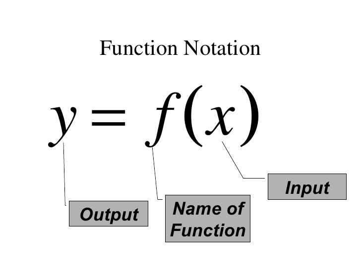
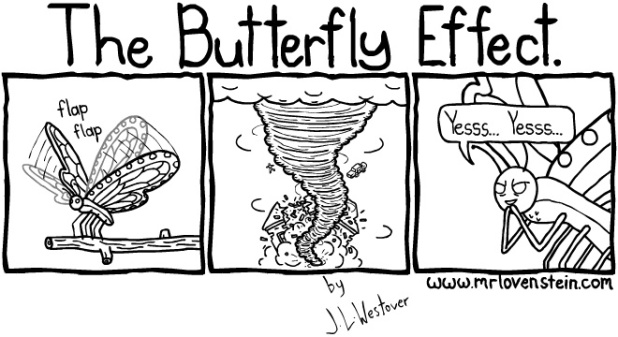
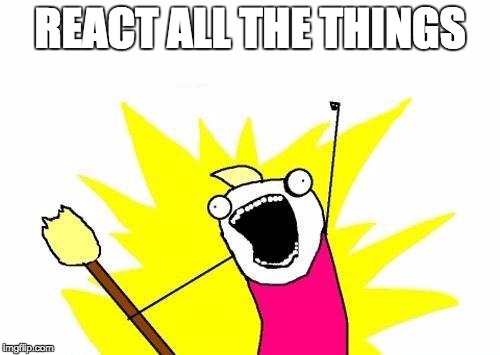
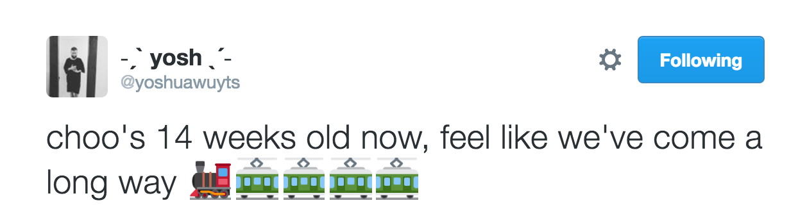

class: center, middle, inverse
# Hi
### [whoami](http://reminyborg.com/Whoami/)
---
class: center, inverse
# Agenda
--

### Concepts
--

### React
--

### Choo
---
class: center, middle, inverse
# Concepts
---
.left-column[
## Pure functions
]
.right-column.center-image[]
---
.left-column[
## Pure functions
]
.right-column[
Same parameters in -> Same result out!

```
function hello (name) { return 'Hello ' + name }

hello('Ole Edvard') // Hello Ole Edvard
hello('Remzoor') // Hello Remzoor
```
gives us
- predictability
- testability
- reusability
]
--
.right-column[
We can return
### Virtual DOM elements!

```
function hello (name) { return /* Virtual Dom element! */ }
```
More about that later
]
---
.left-column[
## Pure functions

## Functional composition
]
.right-column[
Composing views with function trees!

Data and event handlers
passed down the function tree

```
// state = { counter: 0 }
function container (state) {
  function add () { state.value++ } // event handler

  return counter({ add: add, value: state.value + 1 })
}

function counter ({ add, value }) {
  return <button onClick=add> value </button>
}
```

Reuse - Refactor - Rule!

```
const header = /*header(title, content)*/
const list = /*user list*/
const user = /*user details*/

header('Users', list)
header('Selected user', user)

// Combine views with at combine functions
header('Combined', combine(list, user))
```
]
---
layout: true
.left-column[
## Pure functions

## Functional composition

## Immutable
]
---
.right-column.center[### Mutating]
.right-column.center-image[]
---
.right-column[
Mutating state
```
let state = { name: 'Remi', age: 29 }

let newState = state
newState.name = 'Remzoor'

console.log(newState) // { name: 'Remzoor', age: 29 }
console.log(state)    // { name: 'Remzoor', age: 29 }

function doINeedToDoSomeExpensiveRedrawing (state, prev) {
  return state === prev
}
doINeedToDoSomeExpensiveRedrawing(newState, state)
// False!
```
]
--
.right-column[
Immutable state
```
let state = { name: 'Remi', age: 29 }

let newState = Object.assign({}, state, { name: 'Remzoor' })

console.log(newState) // { name: 'Remzoor', age: 29 }
console.log(state)    // { name: 'Remi', age: 29 }

doINeedToDoSomeExpensiveRedrawing(newState, state)
// Returns true!
```
]
---
layout: false
.left-column[
## Pure functions

## Functional composition

## Immutable

## Virtual DOM
]
.right-column.center[### Model -> DOM]
.right-column.center-image[]
---
layout: true
.left-column[
## Pure functions

## Functional composition

## Immutable

## Virtual DOM
]
---
.right-column.center[### Mutating the DOM]
.right-column.center-image[]
---
.right-column.center[### Mutating the DOM]
.right-column.center-image[]
---
.right-column.center[### Model -> DOM]
.right-column.center-image[]
---
layout: false
class: center, middle, inverse
# React
---
.left-column[
## React?
]
.right-column[
## What React is:

- View layer

- Html templating

- A very cool module

## What react is not:

- Everything else
]
---
.left-column[
## React?

## JSX
]
.right-column[
React components are defined in JSX

- A way to define HTML templates in JavaScript
- Transpiles into JavaScript

```
// Input (JSX):
let app = <div id="mydiv"/>
```

```
// Output (JS):
let app = React.createElement('div', {id:"mydiv"})
```

Inject values with **{ value }** syntax
```
let id
let app = <div id={id}>
```
]
---
layout: true
.left-column[
## React?

## JSX

## Component
]
---
.right-column[
How do we use it?

User details
```
const User = ({ id, picture, name, profession, select }) => {
  <div className='user-description' onClick={select}>
    
    <h3>{name}</h3>
    {profession}
  </div>
}

export default User // Pure Function!
```

User list
```
import User from './user'

const UserList = ({ users = [], selectUser}) => (
  <div>
    { users.map((user) => ( // Functional composition
      <User key={user.id}
        {...user}
        select={() => selectUser(user.id)}
      />
    ))}
  </div>
)
export default UserList // Pure Function!
```
]
---
.right-column.center[

### Pro tip:

The top controller should do all the magic.
]
--
.right-column.center[
One component to rule them all.

And in the darkness bind them.

\- J.R.R Tolkien

]
---
.right-column[
]
.right-column[
This is where the magic happens

Main App component
```
class App extends React.Component {
  constructor()           // your initial state
  render()                // your basic render func
  componentWillMount()    // prepare your dom
  componentDidMount()     // dom has been changed
  shouldComponentUpdate() // perf optimization
  ... // many more
}
```
]
--
.right-column.center[
With great power comes great responsibility.

\- Uncle Ben
]
---
.right-column.center[### Now we are ready to]
.right-column.center-image[]
---
.right-column.center[### Not likely]
.right-column.center-image[]
---
layout: false
.left-column[
## React?

## JSX

## Components

## Community
]
.right-column[
### React is cool.

### The community is awesome!
]
--
.right-column[
- Redux / State

- Connectors

- Widgets

- Routing

- Tabs

- +++

À la carte
]
---
layout: true
.left-column[
## React?

## JSX

## Components

## Community

## Redux
]
---
.right-column[


- Centralized store

- Well defined actions

- Immutable data structure

- Facilitates Magic!
]
---
.right-column.center[
# Redux Flow

]
---
.right-column[
```
function App(state = initialState, action) {
  switch (action.type) {
    case SET_USER:
      return Object.assign({}, state, {
        user: action.user
      })
    default:
      return state
  }
}
```

Create the store
```
import { createStore } from 'redux'

let store = createStore(App)
```

Dispatch some actions
```
store.dispatch({
  type: 'SET_USER',
  user: 314159
})
```
```
console.log(store.getState())
// { user: 314159 }
```
]
---
.right-column[
```
import { Provider } from 'react-redux'

<Provider store={store}>
  <App />
</Provider>
```

```
import UserList from './user-list'
import { connect } from 'react-redux'
let App = ({ users, selectUser}) => (
  <div>
    <UserList user={users} selectUser={selectUser}/>
  </div>
)

const mapStateToProps = (state) => ({ users: state.users })
const mapDispatchToProps = (dispatch) => ({
    selectUser: (id) => {
      dispatch({ type: 'SET_USER', user: id })
    }
})

App = connect(mapStateToProps, mapDispatchToProps)(App)
```

```
const UserList = ({ users = [], selectUser})
```

]
---
layout: true
.left-column[
## React?

## JSX

## Components

## Community

## Redux

## Build
]
---
.right-column.center-image[]
--
.right-column[
.center[
https://www.npmjs.com/
```bash
npm install --save react react-redux redux
```
]

- Transpile ES2015 Awesomeness -> Regular ES5

- Include all the modules

- Maby minimize?
]
---
.right-column.center[
### Javascript fatigue
Too much, too fast, so tired.
]
--
.right-column[
Not any more!

```bash
npm install -g create-react-app

create-react-app my-app
cd my-app/
npm start
```
]
---
layout: false
class: center, middle, inverse
# Choo
---
.left-column[
## Choo
]
.right-column.center-image[]
--
.right-column[
- Exiting future

- No transpiling (For brand new browsers)

- Built from small interchangable modules!

- Its fast, its fun!

- Tiny, 5kb.

- We are still figuring things out
]
---
.left-column[
## Choo

## Models

## Template strings
]
.right-column[
### Pragmatic redux
```
const app = choo()

app.model({
  namespace: 'main',
  state: { title: '' },
  reducers: {
    update: (data, state) => ({ title: data })
  }
})

send('main:update', 'React and Choo')
```

```
app.model({
  namespace: 'users',
  state: { list: [] },
  reducers: {
    add: (data, state) => ({ list: state.list.concat(data) })
  }
})

send('users:add', { id: 1, name: 'Remi' })
```
]
---
.left-column[
## Choo

## Models

## Template strings
]
.right-column[
### Tagged template literals
backtick saves the day
```
let name = 'Remi'
let hello = `Hello ${name}`
```
]
--
.right-column[
no need for JSX or transpiling
```
const html = require('choo/html')

const tree = (state, prev, send) => html`
  <main>
    <h1>Title: ${state.title}</h1>
    <input
      type="text"
      oninput=${(e) => send('update', e.target.value)}>
  </main>
`

// what comes out are real dom nodes tree!
document.body.appendChild(tree)
```
]
---
layout: true
.left-column[
## Choo

## Models

## Template strings

## No virtual DOM
]
---
.right-column.center[### No virtual elements, no virtual DOM]
.right-column.center-image[]
---
.right-column.center[
##### Choo uses Morphdom
Fast and lightweight DOM diffing/patching (without the virtual part)
]
.right-column.center[
#### The real truth is in the dom!
#### Wake up sheeple!
]
---
layout: false
.center[
### Thank you for your time


https://facebook.github.io/react/

https://github.com/facebookincubator/create-react-app

https://github.com/yoshuawuyts/choo
]
